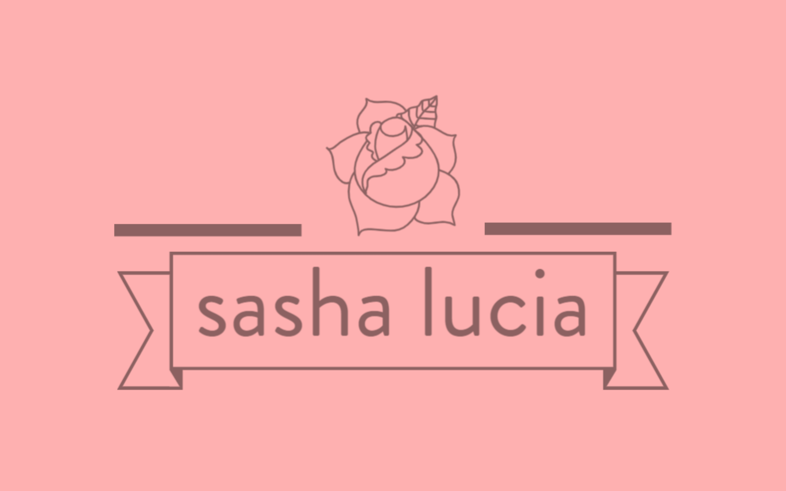

<!DOCTYPE html>
<html lang = "en">
<head>
  <meta charset="UTF-8">
  <meta name="viewport" content="width=device-width, initial-scale=1.0">
  <title>Miles Home</title>
  <link href = "Home.css" rel = "stylesheet">
  
  
</head>
<body>
  

    

      

        
      

      

        <ul class = "navBar">
          <li class="navBarItem dropdown">
            <a class = "dropdown2" href="#">Blog <i class="fas fa-caret-down"></i></a>
            

              <a class = "personalDropdown" href="Blog" target = "_blank">Personal</a>
              <a class = "gyanaDropdown" href="https://www.gyana.com/blog/" target = "_blank">Gyana</a>
              <a class = "sashaLuciaDropdown" href="https://www.sashalucia.net/myblog" target = "_blank">Sasha Lucia</a>
            

          </li>
          <li class = "home"><a class = "navBarItem" href = "Home">Home</a></li>
        </ul>
      

      

        <a class = "signUpButton" href = "https://www.linkedin.com/in/miles-rowbottom-128040155/" target = "_blank">Get in touch</a>
      

    

    

      

    

    

      

        <h2>Who am I?</h2>
        
I'm a third year UCL student and currently studying a 4-year course in Computational Biology. Now, having interned at a London-based SaaS startup, I have gained an appreciation for software development and learning these new languages has become my passion.

      

    

    

      

        

        

          
        

        

          

            <h3 style = "color: darkRed">My University</h3>
            <h4 style = "color: #193342">University College London</h4>
            
Computational Biology MSci

            
Current Average Grade: 74.41

            
TEAM UCL Men's Lacrosse Club President 2020-2021

            
TEAM UCL Men's Lacrosse Social Secretary 2019-2020

          

        

        

      

      

        

        

          
        

        

          

            <h3 style = "color: darkRed">Web Development</h3>
            <h4 style = "color: #193342">My learning curve</h4>
            
HTML, CSS and JavaScript

            
My aim is to push towards full-stack development, one step at a time

            
Learning frameworks such as RWD

            
These tools will help improve both my skillset and my projects

          

        

        

      

      

        

        

          
        

        

          

            <h3 style = "color: darkRed">Data Science</h3>
            <h4 style = "color: #193342">My work experience</h4>
            
Resident Data Scientist, Gyana

            
Used Gyana's software VAYU to create case uses of the product

            
Computational Biology using RStudio

            
Research-level data science to draw conclusions from biological data

          

        

        

      

      

        <h2>My Writings</h2>
        <h3 style = "font-weight: normal !important; margin-left: 20px; margin-right: 20px;">I've written under several domains, including my own, documenting my life experiences and also using my knowledge to discuss my passions: data and technology</h3>
      

      

        

          <h3 style = "color: darkRed">The Gyana Blog</h3>
          
        

        

          <h3 style = "color: darkRed">Personal Blog</h3>
          
        

        

          <h3 style = "color: darkRed">Sasha Lucia Blog</h3>
          
        

      

      

      

      

        
<h2>My highlights so far</h2>

      

      

        

        

          
        

        

        

          <h3>Gyana Limited</h3>
          <h4>Resident Data Scientist, April - July 2020</h4>
          
London, UK

          
Gyana Limited is a 4 year-old startup based in central London. They currently are working to provide a flawless SaaS that empowers everyday people to harness the powers of machine learning and data science.

          
I began working by simply sending the CEO an email. They respected my direct tone and I respected the time they took out of their schedule to hear me out. Through this I learned the importance in putting myself out there; I had the confidence to do so and it paid off in spades.

          
In the role I was tasked with producing regular content in the form of tutorials, blog posts and videos. I developed a wide-range of skills from Inkscape and Canva to web-scraping and text-analysis. The work inspired me to take on web development and software engineering, and was the platform from which I dived into coding.

        

        

      

      

        

        

          
        

        

        

          <h3>TeamUCL Men's Lacrosse Club</h3>
          <h4>Club President, June 2020 - June 2021 Social Secretary, June 2019 - June 2020</h4>
          
London, UK

          
UCL Men's Lacrosse Club is a rapidly growing sports team affiliated to Team UCL. Each year we recruit around 60 members, and we have two teams that play competitively in the South Eastern Conference.

          
In my second year of univesity, I took on the role of social secretary. This meant that making sure every club member always had a great time was my absolute priority.

          
I am currently President of the club as we enter a difficult year of managing sports and socials throughout the Covid-19 outbreak. It is a challenge as our plans a constantly fluid, but I am embracing the opportunity to lead our club in a great direction.

        

        

      

      

        

        

          
        

        

        

          <h3>UCL Students' Union</h3>
          <h4>Student Activities Advisor, November 2019 - Ongoing</h4>
          
London, UK

          
The Students' Union is an essential body in the operations of university life. They act to lobby our university to represent our best interests, and is a group I have very much enjoyed working for.

          
In my role as Student Activities Officer, it was my responsibility to act as the first port of call for clubs and societies wishing to contact the Students' Union. This meant I had to be ready for the challenges they would inevitably keep throwing at me.

          
In this role I have learned the power of effective communication. Without this, smooth work grinds to a shuddering halt. I love working with my peers to help them with their issues, as I understand personally just how important clubs and societies are to a student's wellbeing.

        

        

      

      

    

    

      

        <h2 style = "margin-left: 20px; margin-right: 20px;">Get in touch! I'd love to chat</h2>
        
I prefer to be messaged in my <a class = "linkedinLink" href = "https://www.linkedin.com/in/miles-rowbottom-128040155/">LinkedIn DMs</a>, but use whatever platform that makes you feel most comfortable

      

      

        

        

          <button class = "linkedinButton socialButton" onclick="window.open('https://www.linkedin.com/in/miles-rowbottom-128040155/','mywindow');"><i class="fab fa-linkedin"></i></button>
        

        

          <button class = "socialButton emailButton" onclick="window.open('mailto:miles.rowbottom@gmail.com','mywindow');"><i class="fas fa-envelope-square"></i></button>
        

        

          <button class = "socialButton facebookButton" onclick="window.open('https://www.facebook.com/miles64537/','mywindow');"><i class="fab fa-facebook-square"></i></button>
        

        

      

      

    

  

</body>
</html>

